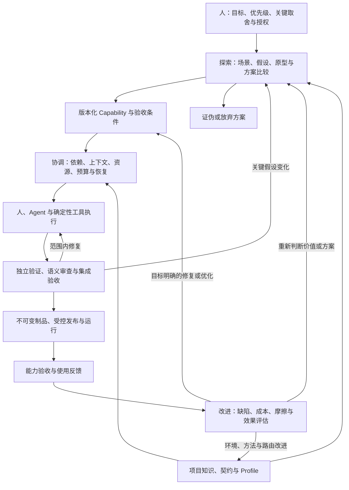
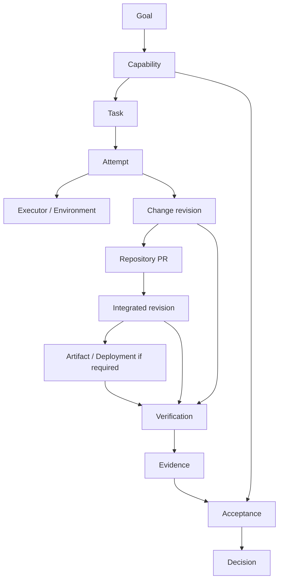

# Daedalus Architecture v0

状态：Architecture v0 Design Draft，2026-09-26。范围：完整工程系统的目标架构，以及支撑它的领域与控制语义。本文按核心指南覆盖探索、交付、运行和改进；实现按能力增量投入，不预选 CLI、数据库、消息系统或 Web UI。

产品目标见 [product.md](product.md)，外部交付契约及项目工程约定见 [engineering.md](engineering.md)。下述生命周期是实现设计的起点，详细接口和状态转换测试在首个可执行切片中落实。

## 1. 系统职责

Daedalus 的产品边界是一套完整工程系统，包括人的判断、工程契约、控制软件、执行资源、仓库交付和运行反馈。自主实现的 Engineering Delivery Control Plane 是其中的协调组件：将目标组织为工作，解析依据、分配资源、管理恢复、关联证据并连接验收与改进。不能以控制组件的范围替代整个产品的目标。

Repository Delivery Plane 承担仓库内 Branch / PR / CI / Review / Ruleset / Integration / Release。该层内部本身具有交付控制机制；五层模型表达责任，不意味着每个请求必须按五层串行传递，也不要求部署成五个服务。

| 层 | 职责 | 与 Daedalus 的关系 |
| --- | --- | --- |
| L5 Product / Intent | 目标、价值、需求、优先级和关键取舍 | 提供 Capability 及验收意图 |
| L4 Engineering Control | Task、Context、Execution、资源、恢复、Evidence、Acceptance、Evaluation | 自研协调语义，连接整个系统 |
| L3 Repository Delivery | 仓库验证、审查、集成与发布 | 提供独立的交付事实和强制准入边界 |
| L2 Execution | Agent、编译器、测试、Runner 和沙箱 | 为 L4、L3 或验收任务提供执行能力 |
| L1 Runtime / Platform | 计算、制品存储、运行环境和观测 | 按任务需求提供资源及运行事实 |

`kb` 是贯穿各层的知识与规范来源，按适用范围和版本引用。Atlas 是可选的平台提供者。隔离工作区用于避免可变状态冲突；权限和凭据隔离由执行环境另外保证，不能把 Git worktree 当作安全沙箱。

### 1.1 三循环目标架构

图中箭头表达责任与信息流；能力验收可在交付前后按项目定义分段进行，线上验证不能提前伪造。持续反馈在首轮验收后继续存在。首个实例可以用人工决策和简单记录实现部分环节，但每项责任都要有承担者。

| 系统能力 | 主要输出 | 实现边界 |
| --- | --- | --- |
| 探索与产品设计 | 问题依据、假设实验、比较取舍、目标与验收标准 | 人负责关键判断，Agent 和工具辅助调查；允许无代码结论 |
| 项目知识与接入 | 固定版本的上下文、环境、检查与交付接口 | 项目和知识源维护契约，控制面解析适用依据 |
| 协调与资源分配 | 依赖计划、执行选择、预算、进度及阻塞视图 | 不重复实现执行器的推理工具循环 |
| 工程执行 | 候选变更、实验和运行事实 | 可替换执行器与环境，按授权完成自主修复 |
| 独立验证与集成 | 适用证据、语义判断、仓库准入和集成事实 | 仓库保留验证逻辑和强制准入边界 |
| 制品、发布与运行 | 不可变交付物、部署关联、诊断恢复路径 | 复用包仓库、发布流程和运行平台 |
| 反馈与持续评估 | 用户效果、缺陷、成本、退化及后续决策 | 同时改进产品和工程系统，保留改进依据 |

### 1.2 调度、资源与统一交付视图

调度输入包括任务依赖、风险、所需证据环境、当前队列瓶颈、执行器能力和剩余预算。只有前置条件、授权、环境和资源满足时才派发；共享未稳定接口的写入串行或重新拆分。复核积压时优先增加验证与集成投入，不无限启动实现任务。

资源选择单位为“模型 × 执行框架 × 工具集合 × 上下文 × 运行环境”。默认一个任务负责人；独立调查、边界清晰模块或专项审核按需并行。机械转换优先确定性工具，复杂分析允许实验与强推理，专业判断可以交给领域专家。人工方案也要记录成本和理由，后续据评测自动化。

预算覆盖时间、重试、并发、模型、CPU/GPU、存储与人工介入。需要预算扩展时暴露已完成成果、消耗和可选路径；取消或资源耗尽后核对在途动作与资源释放，不能仅停止发送消息。

环境选择服从证据需求：macOS 原生行为在相应环境验证，服务端可用可重建 Linux 环境，性能结论使用适当的稳定 Runner，GPU 按实际负载投入。工具链固定、预构建和缓存用于缩短准备；缓存可丢弃，不作为验证制品的唯一保存位置。

统一交付视图展示能力与任务、实际进展、阻塞原因、候选结果、验证覆盖、待决事项、预算及下一步资源需求。每项状态可追溯到实际记录，不能由互不一致的 Agent 总结拼成“成功”。

### 1.3 候选资源组合与可替换边界

下表来自核心指南，表达首选调查方向，不代表性能排名、版本兼容性或平台能力已在项目中核验。G2 才绑定实际版本、协议、身份和资源；替换工具不应重写核心领域身份。

| 能力 | 候选组合 | 接入时核验 |
| --- | --- | --- |
| 工作与变更协作 | GitHub Issues / Projects / PR | 外部身份、事实来源、实际仓库权限和流程 |
| 工程执行 | Codex CLI，需程序化控制时评估 App Server | 生命周期、事件、审批、取消和恢复能力 |
| 替代执行与复核 | Claude Code 等执行器、独立会话、领域专家 | 任务适配、独立性、结果质量和总成本 |
| 确定性自动化 | 仓库入口与 GitHub Actions | 受测对象、可信生产者、规则与权限 |
| 开发与验证环境 | 本地原生、可重建 Linux、专用 Runner | 平台覆盖、隔离、资源生命周期和复现条件 |
| 知识与工作方法 | Markdown、短 AGENTS 入口、版本化 Skills | 来源、适用范围、加载与更新方式 |
| 制品和运行 | 包或镜像仓库、受保护发布流程、Atlas 等平台 | 不可变身份、权限、部署核对和恢复 |
| 观测 | 结构化记录；服务按需评估 OpenTelemetry 与后端 | 采集覆盖、存储查询、保留和数据边界 |

集成开发平台、Agentic Workflows、Symphony 或持久工作流设施可按真实缺口评估；不依赖未验证的功能、预览承诺或某个具体实现。无需为了接入更换用户编辑器，也不要求所有消费项目采用 Kubernetes。

### 1.4 分层验证、发布与反馈

| 层次 | 目的与输入 | 输出边界 |
| --- | --- | --- |
| 快速反馈 | 开发中的格式、类型、诊断、定向测试和局部运行 | 帮助修复，不替代独立候选验证 |
| 独立候选验证 | 干净且权限适当的环境，明确代码、输入、验证器和规则版本 | 回归、集成、契约及风险证据；依实际仓库门禁判断准入 |
| 能力验收 | 实际组合版本与使用路径 | 行为、架构、体验、性能、安全和维护要求的覆盖结论 |
| 发布后验证 | 实际分发或运行对象、观察窗口和用户使用 | 可用性、错误、性能、成本、实际价值及新的改进工作 |

Web 产品验证关键用户路径；库和 CLI 验证安装、接口、资源与错误行为；数据系统验证重复、乱序、回放和恢复；基础设施验证实际部署行为。换一个模型不能单独建立审查独立性，仍需核对依据、测试、环境和职责。测试未发现问题只说明覆盖范围内未见失败，不是整体正确性的证明。

发布对象是经验证的不可变制品，绑定代码、构建方式、验证与授权。向环境提升同一制品；若重新构建，视作新的对象并重新判断所需验证。来源声明需要实际验证，也不能单独证明安全。多个 PR 单独通过不能替代实际组合验证；首个 GitHub Profile 需核对其合流事件、检查对象及队列规则。

候选变更执行者、验证执行者、发布执行者使用职责与权限分离的身份和环境。候选代码构建测试不持有生产或发布凭据，执行器凭据不能暴露给整个候选代码运行环境。发布动作需有效授权，结果未知时先核对实际制品或部署状态。

Feedback 绑定受影响的能力、制品或运行环境、观察窗口、来源、影响和证据；Evaluation 比较明确版本的任务集、配置、质量、人工介入与总成本。反馈经判断形成修复、重新探索、工程系统优化或有理由的暂不行动，关联后续 Task / Capability。升级模型、Skills、工具或环境均检查代表性任务上的退化，保留采用或回退理由。

## 2. 四个交付控制抽象

以下对象连接完整目标架构中的工程交付；探索、资源、运行与改进能力仍按 §1 承担责任，不被这四个对象取代。

| 抽象 | 回答的问题 | 最小语义 |
| --- | --- | --- |
| Capability | 使用者最终得到什么能力？ | 目标、范围、非目标、验收标准及其版本、依赖、授权范围、资源预算、交付对象和验收责任 |
| Task | 哪项工作需要完成？ | 稳定身份、所属能力、任务契约、前置条件、适用上下文、授权引用、预算和完成条件 |
| Execution | 工作实际如何尝试完成？ | 以 Attempt 记录执行器、环境、工作区、代码基线、候选结果、事件、消耗及外部操作 |
| Evidence / Acceptance | 依据什么判断能力完成？ | 可追溯观察、适用对象、验收标准覆盖、未满足项、判断来源与版本化结论 |

Task 身份独立于 Agent 会话。一次 Task 可以跨多个 Attempt；同一 Attempt 内的工具或会话交互必须满足 §7 的连续性条件。恢复会话只是执行机制，恢复 Task 还要核对真实工作区、版本、验证、外部操作和剩余授权。

## 3. 交付控制对象关系

箭头表示关联或产出，不是唯一执行顺序。主要基数与约束如下：

- 尚在澄清的 Capability 可以没有 Task；进入执行后包含一个或多个 Task。Task 可以有前置依赖，v0 的依赖计划应能形成无环执行顺序，迭代通过新任务或新修订表达。
- 一个 Task 有零到多个 Attempt；每个 Attempt 归属一个 Task。没有代码变更的研究任务也可以完成自己的契约。
- 一个 Attempt 可以产生零到多个 Change 修订；多个 Attempt 可以继续同一 Change。Change 与 PR 的关联显式记录，不能假设一次尝试必然新建一个 PR。
- Capability 与 PR 通过 Task / Change 关联，允许一项能力有多个 PR。若一个 PR 服务多个任务，仍须满足仓库的语义内聚要求。
- Verification 可针对候选版本、集成版本、制品或部署；Acceptance 可引用来自多个任务、PR 和环境的证据。
- 每个能力验收标准需映射到支持它的证据或明确的未满足项；列出全部绿色 PR 不能替代这张覆盖关系。

## 4. 支撑对象与外部映射

下列对象是语义组成，不要求现在各建一个文件、表或服务。

| 对象 | 用途 |
| --- | --- |
| Project / Goal | 归属、目标背景及能力间关联；探索依据和取舍按版本关联，不强求独立服务 |
| Context | 来源、版本、权威级别、适用范围和解析结果 |
| Policy / Profile | 判断规则及项目类型适配；固定版本，不随候选修改静默更新 |
| Authorization | 动作、目标、身份、范围、有效期或失效条件、预算限制及授权来源 |
| Executor / Environment / Resource | 执行者能力、实际环境身份、资源约束及分配 |
| Change | 基线与候选版本、差异、仓库和外部 PR 关联 |
| Verification / Evidence | 验证执行与其产生的事实、日志和制品引用 |
| Acceptance / Decision | 能力验收过程及依据某版标准作出的结论 |
| Artifact / Deployment | 不可变制品身份及其在具体环境中的运行关联 |
| Feedback / Evaluation | 关联使用与运行问题、改进任务，以及产品和工程系统效果比较 |

| Daedalus 对象 | 可能的 GitHub / Git 关联 | 不可混同的语义 |
| --- | --- | --- |
| Task | Issue 或内部工作项 | Issue 是外部表示，不是任务身份本身 |
| Attempt | Worktree、Branch、执行会话 | 工作区是执行资源，不是一次尝试的全部状态 |
| Change | PR 及其 head / base 修订 | PR 是可变化的容器，证据必须绑定具体修订 |
| Verification | Actions run / job / check | 检查名称相同不保证来源、对象或结论相同 |
| Integration observation | 实际合并状态和集成提交 | 请求合并不等于已经合并 |
| Artifact | Release / Package 中的具体制品 | Release 名称不替代制品内容摘要 |
| Decision | 可引用 Review 与门禁结果 | 能力验收结论不等价于 Review 或 Ruleset |

外部系统保留各自事实源，Daedalus 保存稳定引用、观察时间、版本及必要证据。投影或缓存过期时重新核对，不把多处复制的状态都当成“最新真相”。

### 4.1 Identity、Revision 与不可变记录

稳定 ID 表示领域身份，revision 表示语义修订；状态投影的并发版本用于防止旧写入覆盖，不与语义 revision 混用。外部 Issue / PR / 会话 ID 是关联字段，不能替代内部身份。

| 对象 | 身份与修订规则 | 可变与不可变边界 |
| --- | --- | --- |
| Project / Goal / Capability / Task | 稳定 ID；目标、范围、标准、依赖等契约变化创建新 revision | 历史契约不覆盖；当前指针和进度投影可更新 |
| Context / Policy / Profile | 引用来源、固定 revision 与 digest | 执行使用解析后的固定快照；更新显式采用，不追随 latest |
| Attempt | 每次尝试有独立 ID，绑定 Task revision 与执行输入 | 初始绑定和事件保留；进度由记录推导，终结后不复活原尝试 |
| Change / Change Revision | Change 有稳定 ID；每个候选修订独立识别 | 绑定仓库、基线、候选内容身份与必要输入；PR head 改变不覆盖旧修订 |
| Verification / Evidence | 每次验证调用独立 ID；每份证据独立 ID | 验证进度可投影，事实追加保存；更正或撤销新增记录，不改写原结果 |
| Acceptance / Decision | 每次验收评估有 ID；Decision 为不可变结论 | 固定能力 revision、标准与交付对象；重新评估产生新记录并关联旧结论 |
| Artifact / Deployment | 制品用内容身份；每次部署操作及观察有独立关联 | 发布标签和环境指针可移动，不能替代具体内容和部署身份 |
| Feedback / Evaluation | 稳定记录 ID，关联观察对象和评估配置 | 保留原观察与评估结论，补充和处置通过后续记录关联 |

例如 `Capability C17@v3` 更改某条标准后，产生 `v4` 和新的验收上下文；旧 Evidence 仍存在，但必须重新判断是否支持新命题。PR #42 的 head 从 `aaa111` 变为 `bbb222`，在证据中是不同候选对象，即使 PR 编号未变。

### 4.2 Event、Fact、State、Evaluation 与 Decision

Event 是被记录的发生或观察，包含来源和时间；Fact 是该来源支持的事实断言，仍需核对可信性；State 是依据事实与规则形成的当前投影；Evaluation 判断事实是否满足条件；Decision 记录指定责任角色的结论。Policy 与 Authorization 分别限定判断及允许动作。

例如“收到进程退出事件”支持“退出码为 0”这一事实，在执行协议满足后可以令 Attempt 为 succeeded；Task 是否满足输出契约仍需评估，Capability accepted 还需全部必需证据和语义判断。不能沿这条链自动传播一个 SUCCESS。

## 5. 权威与控制边界

| 事项 | 权威或执行位置 | Daedalus 的行为 |
| --- | --- | --- |
| 目标、取舍、验收标准 | 版本化能力契约及指定责任人 | 分解工作、提出澄清、记录已接受修订 |
| 项目行为与验证逻辑 | 项目契约和仓库自有入口 | 解析适用版本并调用，不另建中央测试实现 |
| 仓库合流验证证据 | 所采用 Profile 指定的可信 CI | 核对来源、对象、完整性及当前适用性 |
| 合流准入 | 仓库 Ruleset / Branch Protection 与审查要求 | 观察或提交已有授权的请求，不绕过保护 |
| 可执行动作 | 有效授权、身份权限和执行环境 | 动作前核对边界，记录请求及实际结果 |
| 能力验收 | 验收标准、可信证据和指定验收角色 | 聚合覆盖关系，产生可追溯结论 |

外层固定身份、范围、预算、必需验证与允许副作用；内层执行器自主选择研究、实现、调试和修复路径。是否需要人为判断由契约确定，不能把尚未编码的判断伪装成自动通过。

预先批准的自治范围覆盖允许的动作、对象、身份、风险和预算。范围内研究、实现、修复、复验及已授权的交付动作自主进行；只有不可消除的歧义、关键契约变化、权限预算扩展、不可接受风险或必要判断才升级处理。既有授权可复用，技术权限不自行扩大业务授权。

必须区分四件事：事实证据、评估结论、操作授权、动作执行结果。例如：检查通过不授予合并权限；有权限不代表门禁通过；请求被接收不代表实际完成；能力验收通过不改变 GitHub 的准入规则。

## 6. 项目上下文与验证接口

执行前解析一份固定的任务上下文：代码基线、能力与任务契约、规范和 Profile 版本、项目差异、适用检查、环境条件和已有授权。区分要求性契约、参考材料和当前实现事实。

Core / Profile / Instance 分别表达共享领域与工程语义、项目类型适配、具体项目采用版本和差异。Markdown 保存契约，AGENTS.md 提供导航，Skills 封装可复用方法，脚本和 CI 执行确定性检查，运行记录保存证据；强制边界不能只存在于可选 Skill 中。

项目声明验证入口、工作目录、运行环境、输入、适用条件和结果位置。Daedalus 选择时机与资源、启动并记录运行。项目继续维护实际编译、测试和检查逻辑；无需在中央控制系统中复制每种语言的命令矩阵。

候选补丁可能合法地修改测试或规则，但其新规则不自动成为接受自身的依据。应固定原有接受基线，识别策略面变化，记录相应审查与新版本采用决定。无法确定适用检查时应扩大验证或标记受阻，不能静默省略要求。

## 7. 状态与恢复

状态按对象分别管理，避免一个总的 `SUCCESS` 混淆执行结束、检查通过、合并和能力完成。

| 对象 | v0 状态语义 | 完成或推进条件 |
| --- | --- | --- |
| Task | pending / ready / active / blocked / completed / cancelled | 依赖与契约满足才 ready；completed 取决于该任务完成条件，不从模型退出直接推导 |
| Attempt | queued / running / succeeded / failed / interrupted / cancelled | 记录执行是否结束及原因；succeeded 只表示执行协议成功结束，仍需核对任务产出和验证 |
| Verification | queued / running / passed / failed / skipped / error / cancelled / unknown | passed 需要可信运行事实；skipped 需有允许规则，不能当作已经执行通过 |
| Acceptance | pending / evaluating / accepted / rejected / blocked | accepted 绑定明确能力修订与交付对象；证据不足为 blocked，明确违反标准为 rejected |

### 7.1 状态推进与 Attempt 边界

Task 的 ready 要求依赖、输入和执行前提已满足；派发后 active，遇到缺失依据、权限或资源时 blocked；解除阻塞需重新核对条件。completed 要求对指定 Task revision 的完成条件已有支持。Task 完成不必等于 Capability 验收，取决于任务职责；取消不等于撤销已发生副作用。

Attempt 绑定 Task revision、解析上下文、主要执行器及配置、输入基线和环境身份。资源用量按 Attempt 归集，跨 Attempt 的 Task 总成本包含失败尝试和恢复核对，不能重试后清零。

| 情形 | 同一或新 Attempt | 条件 |
| --- | --- | --- |
| 工具调用、测试失败后的范围内修复、同一执行中的多次交互 | 同一 Attempt | 契约与绑定保持，所有权和执行连续性可确认 |
| 客户端断连后重新连接仍存活的执行 | 同一 Attempt | 核对运行身份、工作区、事件与在途操作，确认没有第二写入者 |
| 执行环境或主要执行器已终止，需要重新启动工程执行 | 终结旧 Attempt，创建新 Attempt | 保留旧结果和来源关联；恢复已有会话不恢复原 Attempt 身份 |
| Task revision、主要执行器配置或执行输入基线发生实质变化 | 新 Attempt | 显式记录新绑定与采用依据；工作区候选的正常编辑不属于重新绑定基线 |
| 无法确认旧执行是否存活或仍拥有工作区 | 暂不启动新写入 | 保持观察未知，核对或可靠撤销旧所有权后才能重新分配 |

Attempt 的 succeeded / failed / interrupted / cancelled 是封闭的历史结果；新执行另建 ID。运行中失联不立即推断 interrupted。主动取消先记录请求，实际停止确认前不视为 cancelled。工作区可在核对和显式移交后复用；新 Attempt 不是清空已有修改的理由。

任务阶段（实现、验证、等待集成、验收）作为进度信息记录，不代替结果语义。具体执行器如何证明连续性由 Adapter 提供事实，不能自行重定义以上边界。

### 7.2 外部操作与未知结果

外部操作另有稳定 operation ID、动作目标、期望修订、授权引用、请求状态和核对结果。结果未知时：

1. 保留请求意图与关联标识，阻止冲突写入。
2. 查询目标系统实际状态，例如远端分支提交或对应 PR。
3. 能确认成功则补记事实；确认未发生且授权仍有效才考虑重试。
4. 无法判定则保持 unknown / blocked，交付已有证据与阻塞原因。

requested 表示操作意图已持久记录，sent 表示已尝试发送，confirmed 表示目标系统事实确认预期效果，failed 表示有确定的失败及副作用范围证据，unknown 表示效果无法判定。状态来自可追溯观察，不从网络异常猜测；若可能部分完成，应记录已发生和未确认部分并进入核对。

同一逻辑副作用的传输重试关联同一 operation ID 及可用的幂等键，每次发送分别记录。新 Attempt 也必须先核对旧操作，不能仅因换了 Attempt 就再次创建 PR 或部署。若目标或请求语义改变，则新建操作并关联前序；不同请求不能复用幂等键。

不能承诺跨平台恰好执行一次。需要以目标系统的幂等能力、稳定关联与核对策略减少重复副作用；查询不完备不能当作“确定未执行”。取消请求同样要核对是否已经停止和是否已有副作用。

## 8. 证据与能力验收

每份证据至少关联：稳定标识、生产者与记录来源、验证对象、输入和环境、验证器与规则版本、开始结束时间、实际结果、日志或制品引用，以及它支持的验收命题。内容摘要支持完整性核对，不能代替可信生产者身份。模型解释和人工判断明确标注来源。

提交 SHA 仅在验证输入确实对应该提交时足够识别代码。存在未提交修改时须另记录内容身份或工作区差异，不能把它们归为对干净提交的验证。PR head、测试合并版本、merge group 和最终集成提交可能不同，采集时分别记录实际对象。

证据事实保持历史可追溯；其对某次决策的适用性可以变化。代码、输入、环境、规则或验收标准变化后重新评估。首版默认重新运行受影响的必需验证；不能证明可复用的证据不沿用。历史 accepted 记录不应被抹去，但也不能自动代表新修订已经接受。

### 8.1 Evidence applicability

`applicable(E, DecisionContext)` 是核心领域判断，Adapter 负责提供事实。DecisionContext 固定能力与标准 revision、所需命题、受测对象、输入、环境约束、可信生产者、Policy / verifier revision、时效及完整性要求。

| 结果 | 判定 | 对验收的影响 |
| --- | --- | --- |
| true | 必需元数据与可信性可核对，对象及覆盖满足当前规则；若复用有明确且受信任的等价依据 | 可以用于当前命题，再按证据中的实际结果判断通过或失败 |
| false | 已知违反至少一项适用条件，如候选不同、平台不符、证据撤销、来源不受信任 | 不用于证明当前要求满足；保留事实及不适用理由 |
| unknown | 没有已确认的不适用条件，但信息缺失、来源不可核对或影响分析不足 | 必需证据视为未满足，补验证或核对，不转成 true |

首版默认精确匹配受测对象和要求；跨版本复用需要版本化规则及可复核的等价判断。元数据匹配只能证明适用前提，结果仍须覆盖实际命题。例如一次可信失败测试的 applicability 可以是 true，但它支持拒绝而不是接受；合法 skipped 也不等于已经运行通过。

证据集合必须同时覆盖全部必需标准和判断。发现适用证据互相矛盾或存在尚未处置的失败，先按固定规则调查和裁决，不能只挑一次绿色重跑。撤销或更正通过新增关联记录表达；新的决策上下文必须考虑它们。

### 8.2 能力验收与后续反馈

一次 Acceptance 应列出：

- Capability 及验收标准版本，实际集成版本，以及需要时的制品摘要、部署身份。
- 每条标准对应的证据、适用范围、结果与尚缺项目。
- 必需语义判断、作出判断的责任角色、结论和理由。
- 接受、拒绝或受阻的 Decision，以及后续反馈或取代该结论的记录。

只有全部必需标准有适用支持、所需人工判断已完成，才能 accepted。修改标准必须显式修订并保留依据，不能通过隐藏失败或降级必需条件制造通过。验收契约应覆盖产品价值、设计、实现和交付维护四维质量；生产部署只在该能力需要时纳入，库、CLI、文档和服务采用各自实际使用路径。

验收记录区分交付时已满足的条件、约定的运行观察窗口和持续监测责任。声明需要的发布后验证尚未完成时，不提前宣称全部验收通过。首轮观察结束不等于停止改进，后续反馈形成新的评估或任务并保留历史判断。

## 9. 多 PR 能力示例

“支持 Kafka source”可分为接口整理、输入实现、配置使用文档三个 PR。每个 PR 按仓库工作流独立验证和集成；能力还需要在明确的组合版本上证明能够配置、读取、处理约定失败并输出正确结果。

某个实现 PR 变绿，只更新该 Change 的仓库证据。全部 PR 合入后，Daedalus 核对实际集成版本，执行能力验收入口，关联对应制品，再记录 Acceptance。若其中一个 PR 被回退，原验收仍是对原交付对象的历史事实，当前交付对象需要重新评估。

G1 还需沿以下反例走查模型。它们是设计预期，不代表实现测试已运行：

| 输入变化或观察 | 领域解释 | 预期下一步 |
| --- | --- | --- |
| C17@v3 的标准改为 v4 | 新契约 revision，旧 Decision 不被重写 | 建新验收上下文，逐证据判断 applicability |
| PR #42 head 改变 | 新 Change Revision，原 PR 仍是相同外部容器 | 不能沿用旧 head 的绿色检查证明新候选 |
| Codex 退出码 0，但任务制品缺失 | 执行事实与任务评估不同 | 记录 Attempt 结束，Task 不标 completed |
| 断连但原进程与写入所有权连续 | 观察中断，不是新的工程执行 | 核对后接回同一 Attempt |
| 进程已死，推送是否完成未知 | 旧 Attempt 终结，外部操作仍需核对 | 查远端事实后确定后续尝试，不重复未知副作用 |
| 制品验收通过，后续出现性能退化 | 新 Feedback 关联相同制品与运行条件 | 评估影响，创建修复或重新探索，保留旧验收范围 |

## 10. 首批失败与恢复验收场景

以下是待实现的验收规格，不是已执行测试。

| 场景 | 预期行为 |
| --- | --- |
| Agent 声称完成，但必需检查失败 | 保留候选与失败证据，不标记任务或能力通过 |
| 工具缺失、检查异常、超时、取消或结果不可读 | 明确记录未验证原因，拒绝将未知转换为成功 |
| 检查被跳过 | 核对版本化规则与适用条件；缺少依据则不满足必需验证 |
| 验证后候选版本或验收标准改变 | 保留旧证据，重新评估适用性并补验证 |
| 候选变更修改 CI、门禁或 Profile | 标记控制规则变化，不能自行降低当前接受条件 |
| 同名检查来自错误生产者或不同候选 | 不计入该候选的必需证据 |
| 会话中断但进程仍运行、工作区有修改 | 核对写入者与状态，避免并发覆盖或重新执行 |
| 推送、建 PR 或合并请求结果未知 | 查询目标状态后决定继续；不盲目重试 |
| 各 PR 通过，组合能力测试失败 | 仓库合入事实保留，能力验收拒绝并建立修复工作 |
| 授权过期、预算耗尽或取消 | 停止新增受影响动作，核对在途操作和资源，保存恢复信息 |
| 基线不可访问或摘要不匹配 | 接入受阻，暴露缺失依据，不降级为“已满足” |
| 制品被重新构建或部署指向发生变化 | 核对实际内容身份，重新判断验证与授权适用性 |
| 运行反馈或关键观测缺失 | 标记未验证范围；不把无数据解释为产品可用或没有缺陷 |
| 更便宜的执行配置增加缺陷或人工复核 | 计入失败与复核总成本，拒绝以成本收益抵消质量约束 |

## 11. 架构驱动因素与替代方案

在四维质量与安全约束下缩短目标到可用能力的时间，减少人工协调、返工和维护成本。目标架构覆盖三循环，协调实现优先复用成熟能力，并保证恢复、证据和控制边界。以下比较说明草案方向，尚不取代具体实现决策的评审。

| 选择 | 考虑的替代方案 | 选择理由与代价 |
| --- | --- | --- |
| 执行器中立的领域核心 | 将 Task、状态和结果直接定义为 Codex 会话对象 | 便于迁移和比较资源，但要维护适配及能力差异 |
| 调用仓库验证入口 | 中央系统统一维护所有语言和项目的验证命令 | 保留项目所有权与既有检查，需要明确入口契约和可信来源 |
| Task 与 Attempt 分离 | 以会话历史作为唯一任务状态 | 支持重试与跨会话恢复，但需要独立的事实记录与核对逻辑 |
| 复用仓库合流准入 | Daedalus 自行决定并直接写入主干 | 保持现有强制边界，代价是处理异步状态和外部平台差异 |
| 完整目标架构、按切片投入 | 以首个 Agent → PR 脚本界定整个产品 | 保持产品价值与运行反馈责任，需要显式区分目标能力和已实现能力 |
| 按评测选择资源与角色 | 固定模型、固定 Agent 团队和运行平台 | 适应任务与瓶颈，但需要比较基线、成本记录和替换边界 |

长期影响的技术选择按 [ADR 约定](adr/README.md) 记录。平台、工具和存储选型由真实切片及其证据驱动。

## 12. 持久化与可观测性要求

持久化需要保存稳定标识、版本化契约与探索依据、Attempt、资源消耗、外部动作意图与结果、证据引用、Decision、Feedback 和 Evaluation；不要求现在采用特定数据库或事件溯源架构。快照与事件如何组织应能够解释当前状态及其来源，并支持中断后核对。

外部副作用发出前应记录可恢复的操作意图和关联标识。外部执行与本地记录通常不能构成单一事务，恢复时必须处理“外部已成功、本地未记下”的窗口。并发更新需要版本检查或等价机制，避免旧执行者覆盖新状态；具体所有权、租约和并发控制协议仍待设计。

观测至少关联 Task、Attempt、操作、Verification 和交付对象，记录观察时间、实际事件时间（可获得时）、结果、失败原因、资源消耗与未知项。日志及证据制品需要可定位的来源、适当保留策略与访问边界；凭据不应进入任务记录或公开日志。结构化状态应足以定位阻塞，不依赖重读全部 Agent 对话。

## 13. 架构不变量

1. 任务身份独立于会话和尝试；历史尝试与证据不得因重试被覆盖。
2. 每个可变工作区同一时刻只有明确的写入所有者；worktree 隔离不替代权限隔离。
3. 验证逻辑归仓库，合流准入归既有仓库控制机制；Daedalus 的判断不绕过这些边界。
4. 证据和验收结论绑定明确对象及规则版本；未知、缺失或失效证据不能视作成功。
5. 候选变更不能单方面降低接受自身的条件；事实、结论、授权和实际动作结果分别记录。
6. PR 集成和能力完成分别判断；核心领域模型不依赖某个外部平台的对象身份。
7. 产品架构覆盖探索、交付和改进；四维质量、安全及授权约束不能由速度或成本收益抵消。
8. 发布、验收和反馈关联实际不可变对象及运行条件；没有观测不能证明运行健康或使用价值。
9. 资源与执行器可以替换，不能通过替换降低契约、验证或追溯要求。

## 14. 实现前需要落实的决策

先按 [工程约定](engineering.md) 的 G0 / G1 / G2 审查设计。G0 核对产品目标与四维质量；G1 攻击领域身份、生命周期、适用性、权限、恢复及三循环衔接；G2 再绑定真实消费项目、能力、执行器、环境和最小持久化机制。

实现前仍需落实：规范的 source / revision / digest 与可访问分发；所有权和并发控制协议；可信事件及证据来源；执行器取消恢复能力；仓库准入配置；能力验收入口、观察窗口、制品及发布恢复路径；资源预算与效果比较基线。未解决项须明确责任和推进条件，不能因草案合入而隐式视为已解决。

这些决策应围绕首个切片形成可运行实现。GitHub、Codex、其他执行器和平台接入保持 Adapter 边界；后续由第二个真实场景检验抽象，再决定需要增加哪些通用接口。
