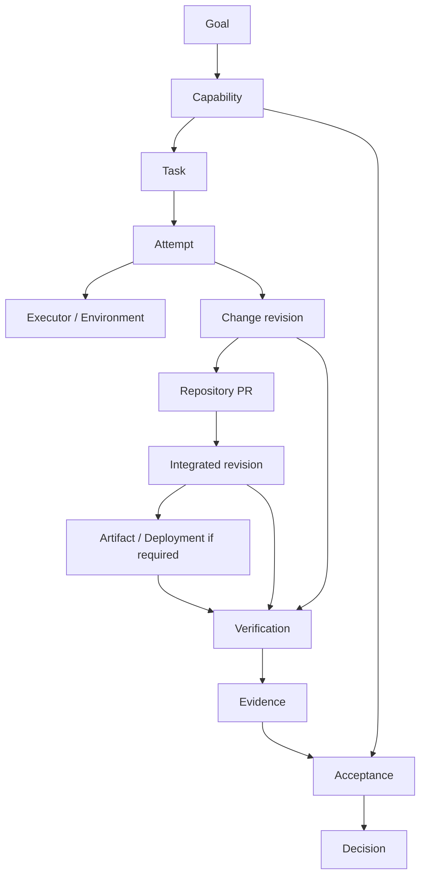

# Daedalus Architecture v0

状态：设计草案，2026-09-26。范围：Capability、Task、Execution、Evidence / Acceptance。本文定义领域语义与预期行为，不预选 CLI、数据库、消息系统或 Web UI。

产品目标见 [product.md](product.md)，外部交付契约及项目工程约定见 [engineering.md](engineering.md)。下述生命周期是实现设计的起点，详细接口和状态转换测试在首个可执行切片中落实。

## 1. 系统职责

Daedalus 是 Engineering Delivery Control Plane：将目标组织为可执行工作，解析依据，选择执行器与资源，管理状态与恢复，关联证据并组织能力验收。

Repository Delivery Plane 承担仓库内 Branch / PR / CI / Review / Ruleset / Integration / Release。该层内部本身具有交付控制机制；五层模型表达责任，不意味着每个请求必须按五层串行传递，也不要求部署成五个服务。

| 层 | 职责 | 与 Daedalus 的关系 |
| --- | --- | --- |
| L5 Product / Intent | 目标、价值、需求、优先级和关键取舍 | 提供 Capability 及验收意图 |
| L4 Engineering Control | Task、Context、Execution、资源、恢复、Evidence、Acceptance | Daedalus 的核心 |
| L3 Repository Delivery | 仓库验证、审查、集成与发布 | 提供独立的交付事实和强制准入边界 |
| L2 Execution | Agent、编译器、测试、Runner 和沙箱 | 为 L4、L3 或验收任务提供执行能力 |
| L1 Runtime / Platform | 计算、制品存储、运行环境和观测 | 按任务需求提供资源及运行事实 |

`kb` 是贯穿各层的知识与规范来源，按适用范围和版本引用。Atlas 是可选的平台提供者。隔离工作区用于避免可变状态冲突；权限和凭据隔离由执行环境另外保证，不能把 Git worktree 当作安全沙箱。

## 2. 四个核心抽象

| 抽象 | 回答的问题 | 最小语义 |
| --- | --- | --- |
| Capability | 使用者最终得到什么能力？ | 目标、范围、非目标、验收标准及其版本、依赖、交付对象和验收责任 |
| Task | 哪项工作需要完成？ | 稳定身份、所属能力、任务契约、前置条件、适用上下文、授权引用、预算和完成条件 |
| Execution | 工作实际如何尝试完成？ | 以 Attempt 记录执行器、环境、工作区、代码基线、候选结果、事件、消耗及外部操作 |
| Evidence / Acceptance | 依据什么判断能力完成？ | 可追溯观察、适用对象、验收标准覆盖、未满足项、判断来源与版本化结论 |

Task 身份独立于 Agent 会话。一次 Task 可以跨多个 Attempt；一次 Attempt 可以调用多个工具或会话。恢复会话只是执行机制，恢复 Task 还要核对真实工作区、版本、验证、外部操作和剩余授权。

## 3. 对象关系

箭头表示关联或产出，不是唯一执行顺序。主要基数与约束如下：

- 一个 Capability 包含一个或多个 Task；Task 可以有前置依赖。v0 的依赖计划应能形成无环执行顺序，迭代通过新任务或新修订表达。
- 一个 Task 有零到多个 Attempt；每个 Attempt 归属一个 Task。没有代码变更的研究任务也可以完成自己的契约。
- 一个 Attempt 可以产生零到多个 Change 修订；多个 Attempt 可以继续同一 Change。Change 与 PR 的关联显式记录，不能假设一次尝试必然新建一个 PR。
- Capability 与 PR 通过 Task / Change 关联，允许一项能力有多个 PR。若一个 PR 服务多个任务，仍须满足仓库的语义内聚要求。
- Verification 可针对候选版本、集成版本、制品或部署；Acceptance 可引用来自多个任务、PR 和环境的证据。
- 每个能力验收标准需映射到支持它的证据或明确的未满足项；列出全部绿色 PR 不能替代这张覆盖关系。

## 4. 支撑对象与外部映射

下列对象是语义组成，不要求现在各建一个文件、表或服务。

| 对象 | 用途 |
| --- | --- |
| Project / Goal | 归属、目标背景及能力间关联 |
| Context | 来源、版本、权威级别、适用范围和解析结果 |
| Policy / Profile | 判断规则及项目类型适配；固定版本，不随候选修改静默更新 |
| Authorization | 动作、目标、身份、范围、有效期或失效条件、预算限制及授权来源 |
| Executor / Environment / Resource | 执行者能力、实际环境身份、资源约束及分配 |
| Change | 基线与候选版本、差异、仓库和外部 PR 关联 |
| Verification / Evidence | 验证执行与其产生的事实、日志和制品引用 |
| Acceptance / Decision | 能力验收过程及依据某版标准作出的结论 |
| Artifact / Deployment | 不可变制品身份及其在具体环境中的运行关联 |
| Feedback / Evaluation | 产品反馈与工程系统效果比较 |

| Daedalus 对象 | 可能的 GitHub / Git 关联 | 不可混同的语义 |
| --- | --- | --- |
| Task | Issue 或内部工作项 | Issue 是外部表示，不是任务身份本身 |
| Attempt | Worktree、Branch、执行会话 | 工作区是执行资源，不是一次尝试的全部状态 |
| Change | PR 及其 head / base 修订 | PR 是可变化的容器，证据必须绑定具体修订 |
| Verification | Actions run / job / check | 检查名称相同不保证来源、对象或结论相同 |
| Integration observation | 实际合并状态和集成提交 | 请求合并不等于已经合并 |
| Artifact | Release / Package 中的具体制品 | Release 名称不替代制品内容摘要 |
| Decision | 可引用 Review 与门禁结果 | 能力验收结论不等价于 Review 或 Ruleset |

外部系统保留各自事实源，Daedalus 保存稳定引用、观察时间、版本及必要证据。投影或缓存过期时重新核对，不把多处复制的状态都当成“最新真相”。

## 5. 权威与控制边界

| 事项 | 权威或执行位置 | Daedalus 的行为 |
| --- | --- | --- |
| 目标、取舍、验收标准 | 版本化能力契约及指定责任人 | 分解工作、提出澄清、记录已接受修订 |
| 项目行为与验证逻辑 | 项目契约和仓库自有入口 | 解析适用版本并调用，不另建中央测试实现 |
| 仓库合流验证证据 | 所采用 Profile 指定的可信 CI | 核对来源、对象、完整性及当前适用性 |
| 合流准入 | 仓库 Ruleset / Branch Protection 与审查要求 | 观察或提交已有授权的请求，不绕过保护 |
| 可执行动作 | 有效授权、身份权限和执行环境 | 动作前核对边界，记录请求及实际结果 |
| 能力验收 | 验收标准、可信证据和指定验收角色 | 聚合覆盖关系，产生可追溯结论 |

外层固定身份、范围、预算、必需验证与允许副作用；内层执行器自主选择研究、实现、调试和修复路径。是否需要人为判断由契约确定，不能把尚未编码的判断伪装成自动通过。

必须区分四件事：事实证据、评估结论、操作授权、动作执行结果。例如：检查通过不授予合并权限；有权限不代表门禁通过；请求被接收不代表实际完成；能力验收通过不改变 GitHub 的准入规则。

## 6. 项目上下文与验证接口

执行前解析一份固定的任务上下文：代码基线、能力与任务契约、规范和 Profile 版本、项目差异、适用检查、环境条件和已有授权。区分要求性契约、参考材料和当前实现事实。

项目声明验证入口、工作目录、运行环境、输入、适用条件和结果位置。Daedalus 选择时机与资源、启动并记录运行。项目继续维护实际编译、测试和检查逻辑；无需在中央控制系统中复制每种语言的命令矩阵。

候选补丁可能合法地修改测试或规则，但其新规则不自动成为接受自身的依据。应固定原有接受基线，识别策略面变化，记录相应审查与新版本采用决定。无法确定适用检查时应扩大验证或标记受阻，不能静默省略要求。

## 7. 状态与恢复

状态按对象分别管理，避免一个总的 `SUCCESS` 混淆执行结束、检查通过、合并和能力完成。

| 对象 | v0 状态语义 | 完成或推进条件 |
| --- | --- | --- |
| Task | pending / ready / active / blocked / completed / cancelled | 依赖与契约满足才 ready；completed 取决于该任务完成条件，不从模型退出直接推导 |
| Attempt | queued / running / succeeded / failed / interrupted / cancelled | 记录执行是否结束及原因；succeeded 只表示执行协议成功结束，仍需核对任务产出和验证 |
| Verification | queued / running / passed / failed / skipped / error / cancelled / unknown | passed 需要可信运行事实；skipped 需有允许规则，不能当作已经执行通过 |
| Acceptance | pending / evaluating / accepted / rejected / blocked | accepted 绑定明确能力修订与交付对象；证据不足为 blocked，明确违反标准为 rejected |

运行中失联先标记观察不确定，核对进程和工作区后再判断是否 interrupted，避免在旧执行器仍写入时启动第二个写入者。重试创建新的 Attempt 标识，保留历史；工作区若被复用，必须先核对所有权和残留状态。任务阶段（实现、验证、等待集成、验收）作为进度信息记录，不代替上述结果语义。

外部操作另有稳定 operation ID、动作目标、期望修订、授权引用、请求状态和核对结果。结果未知时：

1. 保留请求意图与关联标识，阻止冲突写入。
2. 查询目标系统实际状态，例如远端分支提交或对应 PR。
3. 能确认成功则补记事实；确认未发生且授权仍有效才考虑重试。
4. 无法判定则保持 unknown / blocked，交付已有证据与阻塞原因。

不能承诺跨平台恰好执行一次。需要以目标系统的幂等能力、稳定关联与核对策略减少重复副作用；查询不完备不能当作“确定未执行”。取消请求同样要核对是否已经停止和是否已有副作用。

## 8. 证据与能力验收

每份证据至少关联：稳定标识、生产者与记录来源、验证对象、输入和环境、验证器与规则版本、开始结束时间、实际结果、日志或制品引用，以及它支持的验收命题。内容摘要支持完整性核对，不能代替可信生产者身份。模型解释和人工判断明确标注来源。

提交 SHA 仅在验证输入确实对应该提交时足够识别代码。存在未提交修改时须另记录内容身份或工作区差异，不能把它们归为对干净提交的验证。PR head、测试合并版本、merge group 和最终集成提交可能不同，采集时分别记录实际对象。

证据事实保持历史可追溯；其对某次决策的适用性可以变化。代码、输入、环境、规则或验收标准变化后重新评估。首版默认重新运行受影响的必需验证；不能证明可复用的证据不沿用。历史 accepted 记录不应被抹去，但也不能自动代表新修订已经接受。

一次 Acceptance 应列出：

- Capability 及验收标准版本，实际集成版本，以及需要时的制品摘要、部署身份。
- 每条标准对应的证据、适用范围、结果与尚缺项目。
- 必需语义判断、作出判断的责任角色、结论和理由。
- 接受、拒绝或受阻的 Decision，以及后续反馈或取代该结论的记录。

只有全部必需标准有适用支持、所需人工判断已完成，才能 accepted。修改标准必须显式修订并保留依据，不能通过隐藏失败或降级必需条件制造通过。生产部署只在该能力契约需要时纳入，库、CLI、文档和服务采用各自实际使用路径。

## 9. 多 PR 能力示例

“支持 Kafka source”可分为接口整理、输入实现、配置使用文档三个 PR。每个 PR 按仓库工作流独立验证和集成；能力还需要在明确的组合版本上证明能够配置、读取、处理约定失败并输出正确结果。

某个实现 PR 变绿，只更新该 Change 的仓库证据。全部 PR 合入后，Daedalus 核对实际集成版本，执行能力验收入口，关联对应制品，再记录 Acceptance。若其中一个 PR 被回退，原验收仍是对原交付对象的历史事实，当前交付对象需要重新评估。

## 10. 首批失败与恢复验收场景

以下是待实现的验收规格，不是已执行测试。

| 场景 | 预期行为 |
| --- | --- |
| Agent 声称完成，但必需检查失败 | 保留候选与失败证据，不标记任务或能力通过 |
| 工具缺失、检查异常、超时、取消或结果不可读 | 明确记录未验证原因，拒绝将未知转换为成功 |
| 检查被跳过 | 核对版本化规则与适用条件；缺少依据则不满足必需验证 |
| 验证后候选版本或验收标准改变 | 保留旧证据，重新评估适用性并补验证 |
| 候选变更修改 CI、门禁或 Profile | 标记控制规则变化，不能自行降低当前接受条件 |
| 同名检查来自错误生产者或不同候选 | 不计入该候选的必需证据 |
| 会话中断但进程仍运行、工作区有修改 | 核对写入者与状态，避免并发覆盖或重新执行 |
| 推送、建 PR 或合并请求结果未知 | 查询目标状态后决定继续；不盲目重试 |
| 各 PR 通过，组合能力测试失败 | 仓库合入事实保留，能力验收拒绝并建立修复工作 |
| 授权过期、预算耗尽或取消 | 停止新增受影响动作，核对在途操作和资源，保存恢复信息 |
| 基线不可访问或摘要不匹配 | 接入受阻，暴露缺失依据，不降级为“已满足” |

## 11. 架构驱动因素与替代方案

优先保证任务可恢复、交付证据可核对、控制边界可执行，同时减少中央系统的复杂度和人工协调。以下比较说明草案选择的方向，尚不取代具体实现决策的评审。

| 选择 | 考虑的替代方案 | 选择理由与代价 |
| --- | --- | --- |
| 执行器中立的领域核心 | 将 Task、状态和结果直接定义为 Codex 会话对象 | 便于迁移和比较资源，但要维护适配及能力差异 |
| 调用仓库验证入口 | 中央系统统一维护所有语言和项目的验证命令 | 保留项目所有权与既有检查，需要明确入口契约和可信来源 |
| Task 与 Attempt 分离 | 以会话历史作为唯一任务状态 | 支持重试与跨会话恢复，但需要独立的事实记录与核对逻辑 |
| 复用仓库合流准入 | Daedalus 自行决定并直接写入主干 | 保持现有强制边界，代价是处理异步状态和外部平台差异 |

长期影响的技术选择按 [ADR 约定](adr/README.md) 记录。平台、工具和存储选型由真实切片及其证据驱动。

## 12. 持久化与可观测性要求

持久化需要保存稳定标识、版本化契约、Attempt、外部动作意图与结果、证据引用和 Decision；不要求现在采用特定数据库或事件溯源架构。快照与事件如何组织应能够解释当前状态及其来源，并支持中断后核对。

外部副作用发出前应记录可恢复的操作意图和关联标识。外部执行与本地记录通常不能构成单一事务，恢复时必须处理“外部已成功、本地未记下”的窗口。并发更新需要版本检查或等价机制，避免旧执行者覆盖新状态；具体所有权、租约和并发控制协议仍待设计。

观测至少关联 Task、Attempt、操作、Verification 和交付对象，记录观察时间、实际事件时间（可获得时）、结果、失败原因、资源消耗与未知项。日志及证据制品需要可定位的来源、适当保留策略与访问边界；凭据不应进入任务记录或公开日志。结构化状态应足以定位阻塞，不依赖重读全部 Agent 对话。

## 13. 架构不变量

1. 任务身份独立于会话和尝试；历史尝试与证据不得因重试被覆盖。
2. 每个可变工作区同一时刻只有明确的写入所有者；worktree 隔离不替代权限隔离。
3. 验证逻辑归仓库，合流准入归既有仓库控制机制；Daedalus 的判断不绕过这些边界。
4. 证据和验收结论绑定明确对象及规则版本；未知、缺失或失效证据不能视作成功。
5. 候选变更不能单方面降低接受自身的条件；事实、结论、授权和实际动作结果分别记录。
6. PR 集成和能力完成分别判断；核心领域模型不依赖某个外部平台的对象身份。

## 14. 实现前需要落实的决策

选择首个真实消费项目及能力；确定固定基线的分发方式；定义任务与执行记录的持久化契约；核验执行器事件、取消和恢复能力；确认仓库 CI 可信来源和平台准入配置；明确能力验收入口、责任与资源预算。

这些决策应围绕首个切片形成可运行实现。GitHub、Codex、其他执行器和平台接入保持 Adapter 边界；后续由第二个真实场景检验抽象，再决定需要增加哪些通用接口。
